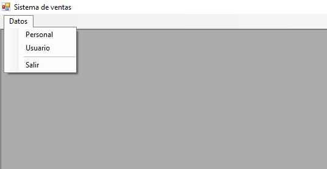
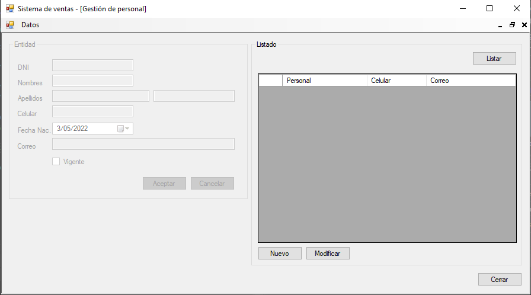
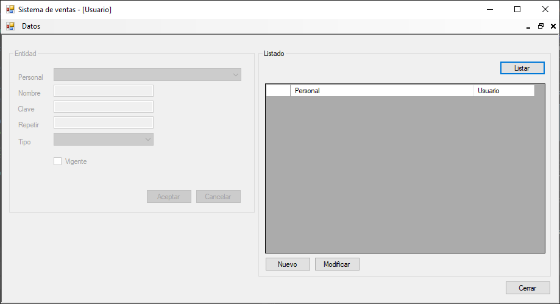

# Gestión de usuarios v2
Sistema de gestión de usuarios en una tienda con base de datos en SQLServer manejado con una clase aparte(DAL), donde podemos gestionar personal que permite registrar, modificar y listar personal, también gestionar usuarios que permite registrar, modificar y listar usuarios, **09/11/20**

<strong>Imagen:</strong> Menú de datos.

<strong>Imagen:</strong> Gestión de personal.

<strong>Imagen:</strong> Gestión de usuarios.

